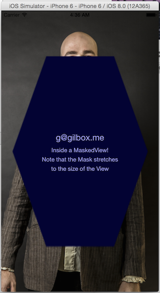

# react-native-masked-view

Masked View Component for React. Just like a `<View />` with a mask.

    <MaskedView maskImage="mask.png">...</MaskedView>

## installation

- `npm install react-native-masked-view`
- `var MaskedView = require('react-native-masked-view');`

... then have a look at [these instructions](https://github.com/chirag04/react-native-dashed-border)
and adjust accordingly.

**note**: react@0.6.0-rc broke MaskedView, but I have a branch called `react-0.6.0` which fixes it but it works slightly differently in that the MaskedView element cannot have it's own backgroundColor, but it's children can. This version is not yet on npm, but you can install it with:

    npm install https://github.com/gilbox/react-native-masked-view.git#react-0.6.0 --save

## props

- `maskImage`: File name of image asset added to Images.xcassets.
[See React Docs for instructions on adding images.](https://facebook.github.io/react-native/docs/image.html#adding-static-resources-to-your-app-using-images-xcassets)

## demo

Just clone this repo and open `MaskedViewDemo.xcodeproj` in xcode to edit the demo pictured above.

## todo

- add more sizing options
- add various mask sources: shape, svg, other layers
- replace `maskImage` prop with `maskSource` prop that works just like `<Image />`'s `source` prop.
  (the internal react-native image-related code really should be refactored so it's more easily
  re-usable outside of `<Image />`)

## notes

- [this react-native commit](https://github.com/facebook/react-native/commit/81401064e5bc0e50de5d77ec9e2384a70e43e2f4#diff-82cd0f8fb7478261a85ac686ac07be50) broke react-native-masked-view@0.0.5 (`updateClippingForLayer` method)... created react-0.6.0 branch with a fix. Might need some additional tweaking. 

